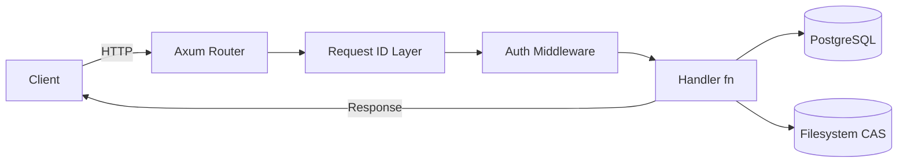
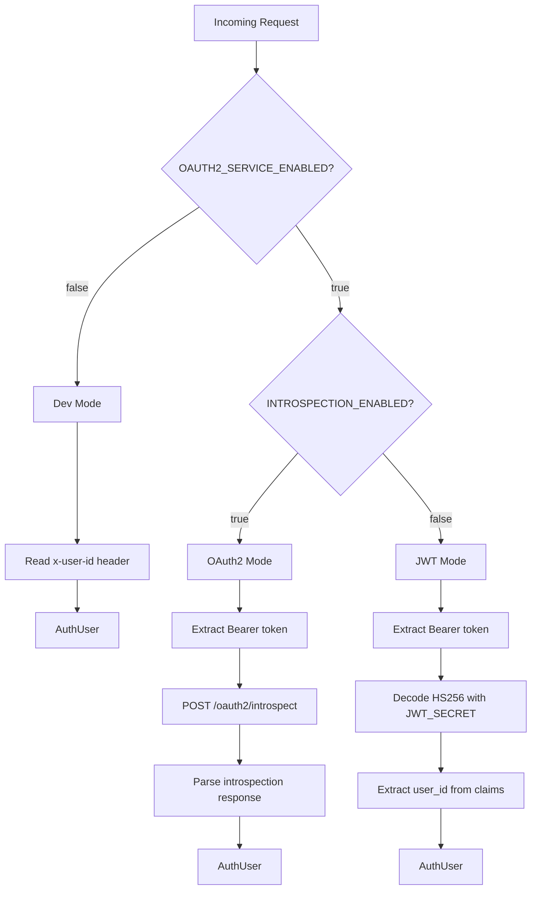
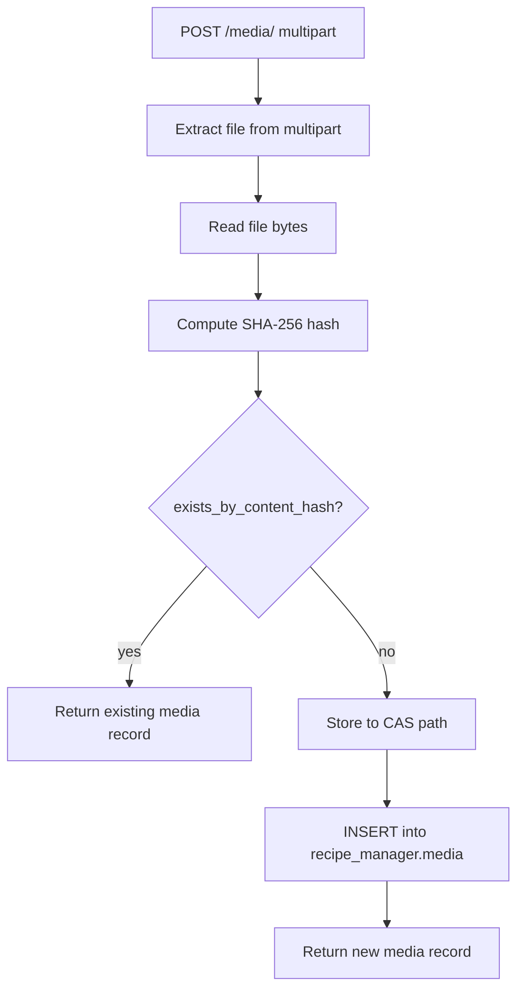
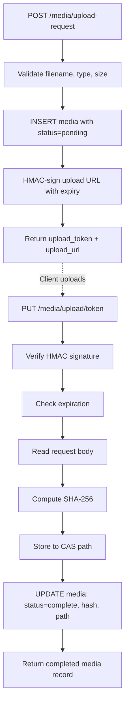

# Media Management Service - Architecture Design

This document is the primary blueprint for the service rewrite. The old implementation had ~65k lines across 56 source files with broken auth, incomplete features, and over-engineered abstractions. The new service targets ~3k lines across 12 source files. Every feature works. No TODOs in production code.

## Module Structure

```
src/
    main.rs          40 LOC   Entry point
    lib.rs           20 LOC   Module declarations, lint config
    config.rs       150 LOC   Flat Config struct from ~20 env vars
    error.rs        120 LOC   AppError enum, IntoResponse impl
    models.rs       200 LOC   Media, ContentHash, ProcessingStatus, DTOs
    db.rs           350 LOC   All SQL queries as async fn(&PgPool, ...)
    storage.rs      150 LOC   Content-addressable filesystem storage
    auth.rs         250 LOC   3-mode auth middleware
    handlers.rs     400 LOC   All HTTP handlers
    routes.rs        80 LOC   Router construction + middleware layers
    presigned.rs    200 LOC   HMAC-signed upload + download URLs
    health.rs        80 LOC   Health/readiness checks
```

### Module Responsibilities

**`main.rs`** - Loads configuration, initializes tracing (stdout-only), connects to PostgreSQL, builds the app state, and starts the Axum server with graceful shutdown. Does nothing else.

**`lib.rs`** - Declares all modules and sets crate-level lint configuration. Re-exports key types for integration tests. Contains no logic.

**`config.rs`** - Defines a flat `Config` struct and an `AuthModeConfig` enum. Loads values from environment variables via `dotenvy` and `std::env::var`. Supports `RUN_MODE=local` (loads `.env.local`) and `RUN_MODE=production` (env vars only). Does not use the `config` crate.

**`error.rs`** - Defines the `AppError` enum with 8 variants mapped to HTTP status codes. Implements `IntoResponse` for Axum integration. Implements `From<sqlx::Error>` and `From<std::io::Error>` for ergonomic `?` usage. Does not define domain-specific error types.

**`models.rs`** - Defines `Media` (DB row), `NewMedia` (insert input), `ContentHash` (validated 64-char hex), `ProcessingStatus` (enum), and all request/response DTOs. The key DTO is `MediaDto` which omits `media_path` (internal), renames `user_id` → `uploaded_by`, and includes a computed `download_url` (signed, null if not complete). Uses `serde` derive for serialization. Does not contain business logic beyond validation.

**`db.rs`** - Contains all SQL query functions as plain `async fn` taking `&PgPool`. Functions: `save_media`, `find_media_by_id`, `find_media_by_content_hash`, `find_media_by_user_paginated`, `update_media_status`, `delete_media`, `exists_by_content_hash`, `find_media_ids_by_recipe`, `find_media_ids_by_recipe_ingredient`, `find_media_ids_by_recipe_step`, `db_health_check`. No trait, no struct, no generics.

**`storage.rs`** - Defines a concrete `Storage` struct with content-addressable filesystem operations. Path format: `{base}/{ab}/{cd}/{ef}/{full_sha256_hash}`. Supports `store`, `retrieve`, `delete`, `exists`, and `health_check`. Uses atomic writes (temp file + rename). Cleans empty directories on delete. No trait.

**`auth.rs`** - Defines `AuthMode` enum (OAuth2/Jwt/Dev), `AuthUser` struct (extracted identity), and the auth middleware function. OAuth2 mode POSTs to the auth-service introspection endpoint. JWT mode decodes tokens with `jsonwebtoken` (HS256). Dev mode reads `x-user-id` header. `AuthUser` is inserted into request extensions for handler access.

**`handlers.rs`** - All HTTP handler functions. Each takes `State<AppState>` and relevant extractors, calls db/storage functions directly, and returns `Result<impl IntoResponse, AppError>`. No use-case layer, no service layer. Handlers are the orchestration point. The download handler supports dual auth (Bearer token or signed URL query params). All handlers returning `MediaDto` include a signed `download_url` for completed media.

**`routes.rs`** - Builds the Axum `Router`, applies middleware layers (auth, request ID, CORS, compression, timeout, security headers, tracing), and nests route groups. Health routes and the download endpoint (dual auth) are outside the auth middleware. Media CRUD routes are inside.

**`presigned.rs`** - HMAC-SHA256 URL signing and validation for both uploads and downloads. See [Signed URL Design](#signed-url-design) below for the full algorithm.

**`health.rs`** - Health check handler (returns healthy/degraded/unhealthy based on DB + storage checks). Readiness handler (binary ready/not_ready). Both run dependency checks with timeouts.

## Key Design Decisions

### 1. No Repository Trait

The current codebase has a `MediaRepository` trait with an associated error type, plus three implementations (`PostgreSqlMediaRepository`, `DisconnectedMediaRepository`, `ReconnectingMediaRepository`). Only one is ever used at runtime.

The rewrite uses concrete functions:

```rust
// db.rs
pub async fn save_media(pool: &PgPool, media: &NewMedia) -> Result<i64, AppError> {
    let row = sqlx::query(r"INSERT INTO recipe_manager.media ...")
        .bind(...)
        .fetch_one(pool)
        .await?;
    Ok(row.get("media_id"))
}
```

No trait, no generics, no associated types. One file of plain functions replaces three repository implementations.

### 2. No Use Case Layer

The current "use cases" are trivial wrappers. `GetMediaUseCase::execute(id)` calls `repository.find_by_id(id)` and converts the result. `DeleteMediaUseCase::execute(id)` calls `repository.delete(id)`. This layer adds indirection without value.

Handlers call DB functions directly:

```rust
// handlers.rs
pub async fn get_media(
    State(state): State<AppState>,
    _user: AuthUser,
    Path(id): Path<i64>,
) -> Result<Json<MediaResponse>, AppError> {
    let media = db::find_media_by_id(&state.db, id)
        .await?
        .ok_or(AppError::NotFound("media"))?;
    Ok(Json(media.into()))
}
```

### 3. Three-Mode Auth via Enum Dispatch

This is the one place where polymorphism earns its keep. The three auth modes have fundamentally different behavior:

```rust
pub enum AuthMode {
    OAuth2 {
        client: reqwest::Client,
        base_url: String,
        client_id: String,
        client_secret: String,
    },
    Jwt {
        decoding_key: DecodingKey,
    },
    Dev,
}
```

Mode selection is determined by config at startup:

- `OAUTH2_SERVICE_ENABLED=true` + `OAUTH2_INTROSPECTION_ENABLED=true` -> **OAuth2**: POST to auth-service `/oauth2/introspect`
- `OAUTH2_SERVICE_ENABLED=true` + `OAUTH2_INTROSPECTION_ENABLED=false` -> **JWT**: decode with shared `JWT_SECRET` (HS256)
- `OAUTH2_SERVICE_ENABLED=false` -> **Dev**: read `x-user-id` header, no validation

### 4. Concrete AppState

```rust
#[derive(Clone)]
pub struct AppState {
    pub db: PgPool,
    pub storage: Storage,
    pub auth_mode: AuthMode,
    pub presigned: PresignedConfig,
    pub max_upload_size: u64,
}
```

No `Arc<dyn Trait>`. No generic parameters. Axum clones `AppState` for each request via its internal `Arc`.

### 5. Flat Configuration (~20 Env Vars)

Down from 150+. No deeply nested config structs. No `config` crate.

```rust
pub struct Config {
    pub host: String,
    pub port: u16,
    pub max_upload_size: u64,
    pub database_url: String,
    pub db_max_connections: u32,
    pub storage_base_path: String,
    pub storage_temp_path: String,
    pub auth: AuthModeConfig,
    pub run_mode: RunMode,
}

pub enum AuthModeConfig {
    OAuth2 { base_url: String, client_id: String, client_secret: String },
    Jwt { secret: String },
    Dev,
}

pub enum RunMode { Local, Production }
```

### 6. Stdout-Only Logging

```rust
fn init_tracing(config: &Config) {
    let filter = EnvFilter::try_from_default_env()
        .unwrap_or_else(|_| "media_management_service=info,tower_http=info".into());
    if config.run_mode == RunMode::Production {
        tracing_subscriber::fmt().json().with_env_filter(filter).init();
    } else {
        tracing_subscriber::fmt().pretty().with_env_filter(filter).init();
    }
}
```

No file rotation. No retention policies. Containers log to stdout; the platform handles collection.

### 7. Streaming Downloads with Cache Headers

Never load entire files into memory. Supports dual auth (Bearer token or signed URL query params). Since storage is content-addressable, files are immutable and can be cached aggressively.

```rust
pub async fn download_media(...) -> Result<Response, AppError> {
    // Auth: accept either Bearer token (from middleware) or signed URL params
    // Signed URL validation happens here if no AuthUser in extensions
    let file = tokio::fs::File::open(path).await?;
    let stream = ReaderStream::new(file);
    let body = Body::from_stream(stream);
    Ok(Response::builder()
        .header(CONTENT_TYPE, &media.media_type)
        .header(CONTENT_DISPOSITION, format!("attachment; filename=\"{}\"", media.original_filename))
        .header(CACHE_CONTROL, "public, max-age=31536000, immutable")
        .header(ETAG, format!("\"{}\"", &media.content_hash))
        .body(body)
        .unwrap())
}
```

### 8. Content-Addressable Storage

SHA-256 hash-based paths. Automatic deduplication. No trait - concrete `Storage` struct.

## Diagrams

### Request Flow



### Auth Decision Flow



### Upload Flow



### Presigned Upload Flow



### Storage Layout

```
media/                          # MEDIA_SERVICE_STORAGE_BASE_PATH
├── ab/
│   └── cd/
│       └── ef/
│           └── abcdef1234...   # Full 64-char SHA-256 hash as filename
├── 12/
│   └── 34/
│       └── 56/
│           └── 1234567890ab... # Different file, different hash
└── temp/                       # MEDIA_SERVICE_STORAGE_TEMP_PATH
    └── upload_a1b2c3.tmp       # Atomic write temp files
```

## Error Handling

```rust
#[derive(Debug, thiserror::Error)]
pub enum AppError {
    #[error("unauthorized: {0}")]
    Unauthorized(String),          // 401

    #[error("forbidden: {0}")]
    Forbidden(String),             // 403

    #[error("not found: {0}")]
    NotFound(&'static str),        // 404

    #[error("bad request: {0}")]
    BadRequest(String),            // 400

    #[error("conflict: {0}")]
    Conflict(String),              // 409

    #[error("payload too large")]
    PayloadTooLarge,               // 413

    #[error("internal error: {0}")]
    Internal(String),              // 500

    #[error("service unavailable: {0}")]
    ServiceUnavailable(String),    // 503
}
```

JSON error response format:

```json
{
  "error": "not_found",
  "message": "media not found"
}
```

Error type values are lowercase snake_case: `bad_request`, `unauthorized`, `forbidden`, `not_found`, `conflict`, `payload_too_large`, `internal_error`, `service_unavailable`.

## API Endpoints

All paths prefixed with `/api/v1/media-management`.

| Method | Path                                | Auth                 | Description                                             |
| ------ | ----------------------------------- | -------------------- | ------------------------------------------------------- |
| GET    | /health                             | No                   | Liveness probe (checks DB + storage)                    |
| GET    | /ready                              | No                   | Readiness probe (binary)                                |
| POST   | /media/                             | Bearer               | Upload file (multipart)                                 |
| GET    | /media/                             | Bearer               | List media (cursor pagination, scoped to user)          |
| GET    | /media/{id}                         | Bearer               | Get media metadata + signed download URL                |
| DELETE | /media/{id}                         | Bearer               | Delete media + file                                     |
| GET    | /media/{id}/download                | Bearer or Signed URL | Stream file download (supports browser rendering)       |
| GET    | /media/{id}/status                  | Bearer               | Processing status                                       |
| POST   | /media/upload-request               | Bearer               | Initiate presigned upload                               |
| PUT    | /media/upload/{token}               | Signed URL           | Complete presigned upload (token carries auth)          |
| GET    | /media/recipe/{id}                  | Bearer               | Media IDs by recipe (wrapped: `{ "media_ids": [...] }`) |
| GET    | /media/recipe/{rid}/ingredient/{id} | Bearer               | Media IDs by ingredient (wrapped)                       |
| GET    | /media/recipe/{rid}/step/{id}       | Bearer               | Media IDs by step (wrapped)                             |

## Signed URL Design

### Algorithm

Both upload and download signed URLs use HMAC-SHA256. The signing secret is `JWT_SECRET` (reused from auth config, always present in all environments).

**Download URL signing:**

```
message  = "{media_id}:{expires_unix_timestamp}"
signature = hex(HMAC-SHA256(JWT_SECRET, message))
url      = "/media/{id}/download?signature={signature}&expires={expires}"
```

**Upload URL signing (presigned uploads):**

```
message  = "{token}:{expires}:{size}:{content_type}"
signature = hex(HMAC-SHA256(JWT_SECRET, message))
url      = "/media/upload/{token}?signature={signature}&expires={expires}&size={size}&type={content_type}"
```

### Download URL Generation

The `download_url` field is included in `MediaDto` responses (GET /media/{id}, GET /media/, POST /media/, etc.):

- **`processing_status == complete`**: Generate a signed URL with a default TTL of 24 hours
- **`processing_status != complete`**: `download_url` is `null`
- TTL is configurable via `MEDIA_SERVICE_DOWNLOAD_URL_TTL_SECS` (default: 86400)

### Download Endpoint Dual Auth

`GET /media/{id}/download` accepts two authentication modes:

1. **Bearer token** (header): Standard auth middleware extracts `AuthUser`. Used for API-to-API calls.
2. **Signed URL** (query params): `signature` + `expires` query params. Used for browser rendering (``). The SSR backend fetches metadata with a Bearer token, then renders the signed `download_url` into HTML.

Validation order:

1. If `Authorization: Bearer` header present → validate via auth middleware (normal flow)
2. Else if `signature` + `expires` query params present → validate HMAC signature, check expiry
3. Else → 401 Unauthorized

**Important**: Use constant-time comparison (`hmac::Mac::verify_slice`) for signature validation to prevent timing attacks.

### Cache Strategy

Content-addressable storage means the same hash always serves the same bytes. Download responses include:

```
Cache-Control: public, max-age=31536000, immutable
ETag: "{content_hash}"
```

- `public` → cacheable by CDNs and proxies
- `max-age=31536000` → 1 year (content never changes)
- `immutable` → browsers skip conditional requests entirely
- `ETag` → supports `If-None-Match` for 304 Not Modified (fallback for caches that ignore `immutable`)

## Configuration

### Environment Variables

```bash
# Runtime
RUN_MODE=local                                # local | production

# Server
MEDIA_SERVICE_SERVER_HOST=0.0.0.0
MEDIA_SERVICE_SERVER_PORT=3000
MEDIA_SERVICE_SERVER_MAX_UPLOAD_SIZE=104857600 # 100MB

# Database
POSTGRES_HOST=localhost
POSTGRES_PORT=5432
POSTGRES_DB=recipe_database
POSTGRES_SCHEMA=recipe_manager
MEDIA_MANAGEMENT_DB_USER=postgres
MEDIA_MANAGEMENT_DB_PASSWORD=
POSTGRES_MAX_CONNECTIONS=10

# Storage
MEDIA_SERVICE_STORAGE_BASE_PATH=./media
MEDIA_SERVICE_STORAGE_TEMP_PATH=./media/temp
MEDIA_SERVICE_DOWNLOAD_URL_TTL_SECS=86400  # 24 hours

# Auth
OAUTH2_SERVICE_ENABLED=false
OAUTH2_INTROSPECTION_ENABLED=false
OAUTH2_SERVICE_BASE_URL=http://localhost:8080/api/v1/auth
OAUTH2_CLIENT_ID=
OAUTH2_CLIENT_SECRET=
JWT_SECRET=

# Logging
RUST_LOG=info

# OpenTelemetry (optional)
OTEL_EXPORTER_OTLP_ENDPOINT=                  # Empty = disabled
```

### Config Struct

```rust
pub struct Config {
    pub host: String,                    // MEDIA_SERVICE_SERVER_HOST
    pub port: u16,                       // MEDIA_SERVICE_SERVER_PORT
    pub max_upload_size: u64,            // MEDIA_SERVICE_SERVER_MAX_UPLOAD_SIZE
    pub database_url: String,            // Constructed from POSTGRES_* vars
    pub db_max_connections: u32,         // POSTGRES_MAX_CONNECTIONS
    pub storage_base_path: String,       // MEDIA_SERVICE_STORAGE_BASE_PATH
    pub storage_temp_path: String,       // MEDIA_SERVICE_STORAGE_TEMP_PATH
    pub download_url_ttl_secs: u64,      // MEDIA_SERVICE_DOWNLOAD_URL_TTL_SECS
    pub auth: AuthModeConfig,            // Derived from OAUTH2_* vars
    pub run_mode: RunMode,               // RUN_MODE
    pub otel_endpoint: Option<String>,   // OTEL_EXPORTER_OTLP_ENDPOINT
}
```

## Lint Configuration

```rust
// lib.rs
#![deny(clippy::all)]
#![deny(clippy::pedantic)]
#![deny(warnings)]
#![allow(clippy::must_use_candidate)]
#![allow(clippy::missing_errors_doc)]
#![allow(clippy::module_name_repetitions)]
```

Formatting: `max_width = 100` in `rustfmt.toml`.
